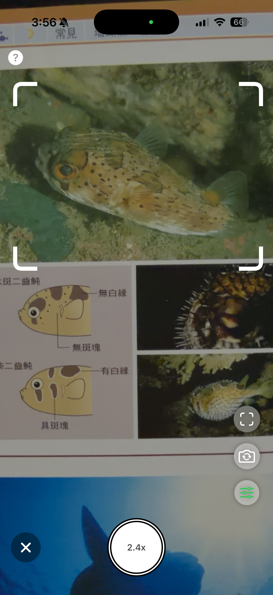
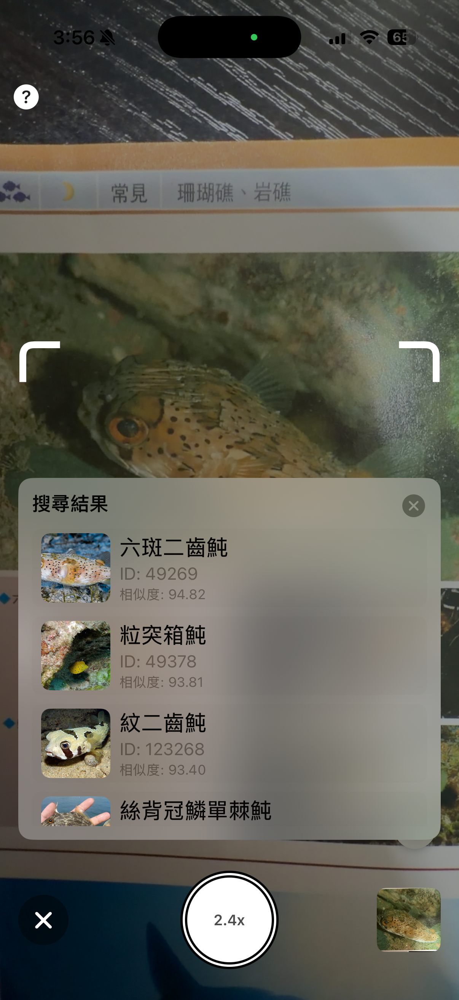
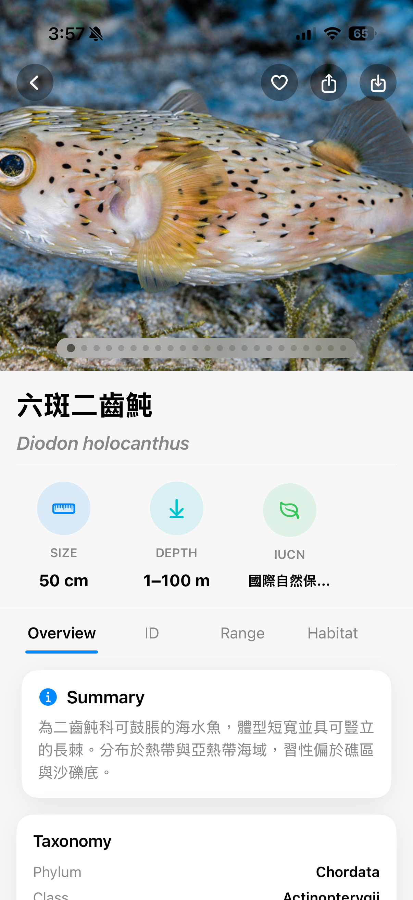
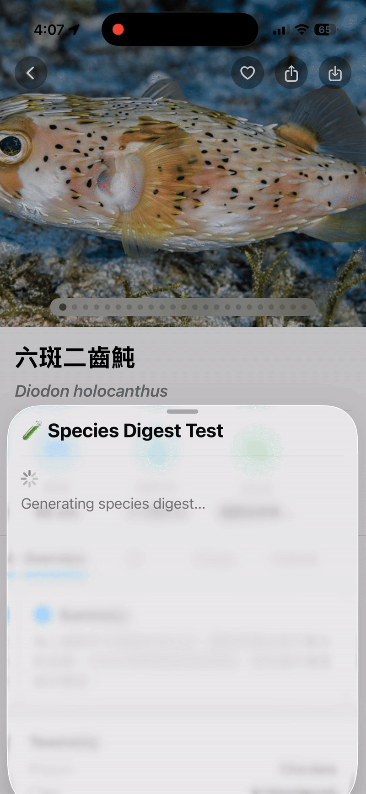

## FishBuddy

An AI-powered fish recognition app built with SwiftUI and Apple Vision framework.

FishBuddy performs fully offline species recognition using embedding vector search and integrates Apple Foundation Model to generate intelligent species summaries.

This project demonstrates advanced iOS engineering practices including camera pipeline optimization, structured data modeling, similarity ranking algorithms, and CI/CD integration.

⸻

## Demo

### Camera recognition preview

### Recognition result screen

### Detail page

### AI summary generation

### ⚠️ Note

Image display currently requires an internet connection (remote image sources are still used).

However, species recognition itself is fully offline — no network access is required once the app is installed.

⸻

## Features

- 🔍 Fully offline fish recognition using embedding vector search
- 📷 Optimized camera pipeline (HDR, device selection, ROI cropping)
- 🧠 Apple Foundation Model integration for species digest generation
- 🗂 Structured SQLite-based taxonomy database
- ⚡ Top-K similarity ranking with configurable acceptance threshold
- 🔁 GitHub Actions CI/CD integration

⸻

## Technical Highlights

### Embedding Search Engine
- Custom vector similarity search
- Top-K ranking
- Threshold-based decision logic
- Optimized for mobile performance

### Camera Optimization
- Dynamic camera device selection (Wide / Tele / Virtual)
- Stable session preset tuning
- HDR auto configuration
- ROI coordinate transformation pipeline

### AI Integration
- Structured prompt engineering
- Generable Guide design
- Model pre-warming strategy for performance stability

### Data Pipeline
- Automated embedding generation workflow
- Taxonomy ingestion pipeline
- Dataset normalization and indexing

⸻

Architecture

Camera
→ Vision Feature Extraction
→ Embedding Vector
→ Similarity Search
→ SQLite Taxonomy DB
→ AI Summary Generation

⸻

## Getting Started

### Requirements
- Xcode 15+
- iOS 17+
- Swift 5.9+

### Installation
1. Clone the repository
2. Open FishBuddy.xcodeproj
3. Build and run on iOS 17 device or simulator

⸻

## Roadmap
- Improve recognition accuracy with larger embedding dataset
- Add distribution map visualization
- Add batch recognition mode
- Optimize embedding indexing performance
- Expand AI summarization capabilities

⸻

License

MIT License

⸻

Author

Developed by Zhe-Hao Lin

Focused on advanced iOS architecture, AI integration, and high-performance mobile systems.
